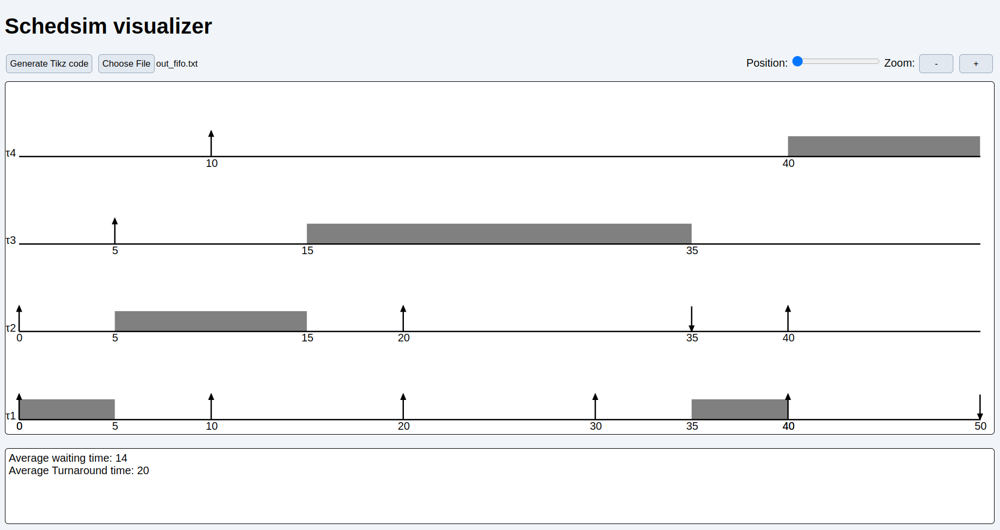

# SchedSim visualiser
SchedSim visualiser is a web-based tool for visualising schedules generated by SchedSim core. 

  

##Features
The visualiser plots the Gannt chart of a schedule inside the web browser.
It is also able to generate the code for the chart in the TikZ format to allow embedding the chart into a LaTeX document.

## License
SchedSim visualiser is Open Source and released under the MIT license. See the [LICENSE.md](./LICENSE.md) file for further details.

